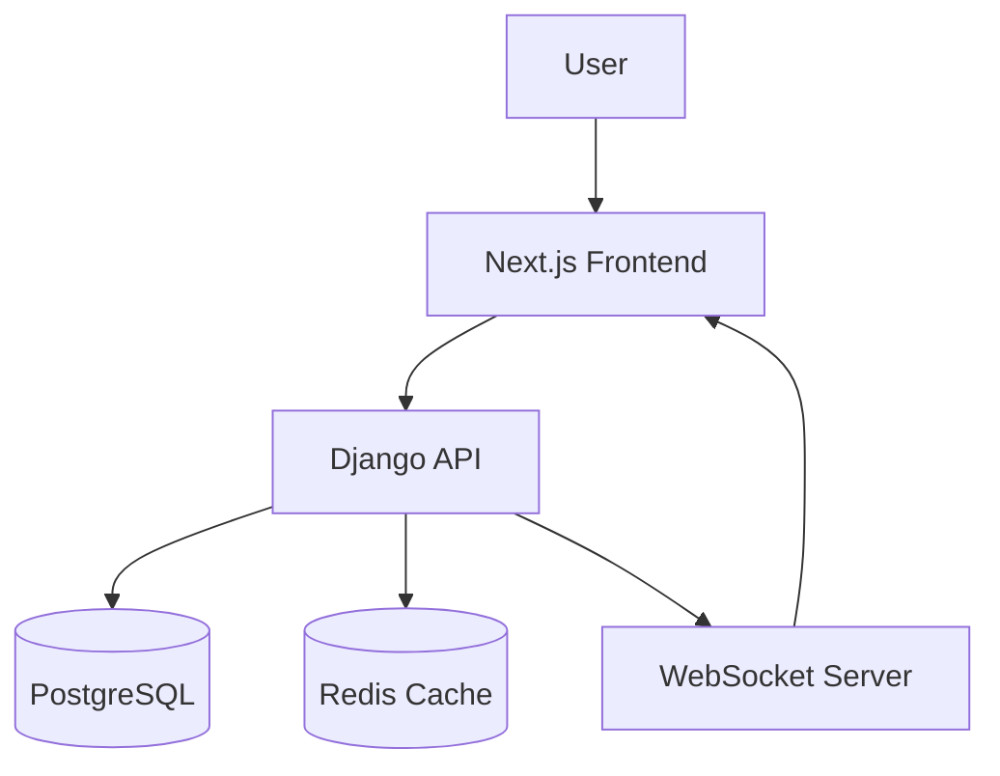
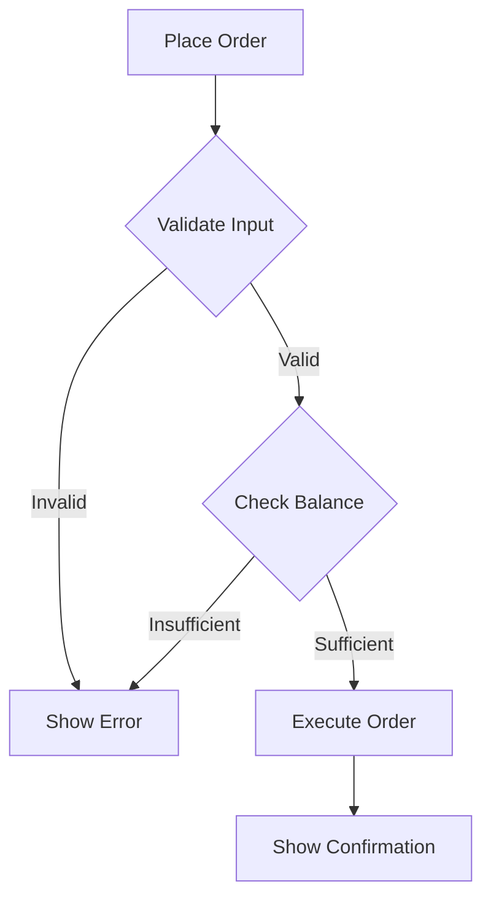

# Documentation Skill

## Overview
Documentation is the art of creating clear, concise, and comprehensive guides that help users and developers understand and use software effectively.

## Key Concepts
- **API Documentation**: Auto-generated from code (OpenAPI/Swagger)
- **User Guides**: Step-by-step tutorials for end users
- **Developer Docs**: Technical documentation for contributors
- **Architecture Docs**: High-level system design and decisions
- **Runbooks**: Operational procedures for incidents
- **README**: Project overview and quick start
- **Changelog**: Version history and changes
- **Documentation as Code**: Docs in version control with code
- **Diagrams**: Visual representations (architecture, flowcharts)
- **Examples**: Code snippets and usage examples

## Learning Resources
- [Diátaxis Framework](https://diataxis.fr/) - Tutorials, How-to Guides, Reference, Explanation
- [Write the Docs](https://www.writethedocs.org/) - Documentation community
- [Google Developer Documentation Style Guide](https://developers.google.com/tech-writing/one)
- [Documentation Style Guide](https://documentation-style-guide.org/)

## Best Practices
- **Know Your Audience**: Write for the right level (beginner vs. advanced)
- **Be Concise**: Get to the point, avoid fluff
- **Use Examples**: Show, don't just tell
- **Keep it Current**: Update docs when code changes
- **Consistent Style**: Use style guide for formatting
- **Searchable**: Use clear titles, keywords, tags
- **Versioned**: Docs should match software version
- **Accessible**: Use alt text, proper heading structure
- **Screenshots**: Visual aids for UI workflows
- **Code Blocks**: Syntax-highlighted, copyable examples

## Tools
- **Static Site Generators**: Docusaurus, MkDocs, VitePress, Sphinx
- **API Docs**: Swagger/OpenAPI, Postman, Insomnia
- **Diagrams**: Mermaid, PlantUML, Draw.io, Excalidraw
- **Screenshots**: CleanShot X, Snagit, macOS built-in
- **Screen Recording**: Loom, CleanShot X, OBS
- **Version Control**: Git (docs with code)
- **Collaboration**: Notion, Confluence, Google Docs
- **Auto-generation**: TypeDoc (TS), Sphinx (Python), Javadoc (Java)

## Documentation Types

### 1. Tutorials
**Purpose**: Learning-oriented, step-by-step lessons
**Audience**: Beginners
**Structure**: Linear, chronological steps
**Example**: "Getting Started with FinanceHub"

```markdown
# Getting Started

## Prerequisites
- Node.js 18+
- Python 3.11+
- Docker installed

## Step 1: Clone the Repository
\`\`\`bash
git clone https://github.com/user/financehub.git
\`\`\`

## Step 2: Install Dependencies
\`\`\`bash
npm install
pip install -r requirements.txt
\`\`\`

## Step 3: Start the Application
\`\`\`bash
docker-compose up
\`\`\`
```

### 2. How-to Guides
**Purpose**: Problem-solving, specific tasks
**Audience**: Users with some knowledge
**Structure**: Goal-oriented steps
**Example**: "How to Place a Limit Order"

### 3. Reference Documentation
**Purpose**: Information lookup, API specs
**Audience**: Experienced users
**Structure**: Factual, structured, searchable
**Example**: API endpoints, component props

```markdown
## POST /api/v1/orders

Create a new trading order.

**Request Body:**
\`\`\`typescript
{
  symbol: string;
  side: 'buy' | 'sell';
  quantity: number;
  type: 'market' | 'limit';
  price?: number; // Required for limit orders
}
\`\`\`

**Response:** 201 Created
\`\`\`json
{
  "id": "order_123",
  "status": "pending",
  "created_at": "2026-02-01T10:00:00Z"
}
\`\`\`
```

### 4. Explanation
**Purpose**: Understanding concepts and context
**Audience**: Anyone seeking deeper knowledge
**Structure**: Discussion, background, rationale
**Example**: "Why We Use Django + Next.js"

## Writing Style

### Voice and Tone
- **Active voice**: "Click the button" not "The button should be clicked"
- **Present tense**: "The API returns" not "The API will return"
- **Direct address**: "You can see" not "Users can see"
- **Simple words**: "Use" not "Utilize", "Start" not "Initiate"
- **Concise**: Delete words that add no meaning

### Formatting
- **Headings**: Clear hierarchy (# ## ### ####)
- **Lists**: For sequences or related items
- **Code blocks**: Syntax highlighted, with language
- **Tables**: For structured data
- **Callouts**: Info boxes, warnings, tips
- **Links**: Descriptive link text (not "click here")

### Code Examples
```markdown
**Good:**
\`\`\`typescript
// Create a new portfolio
const portfolio = await createPortfolio({
  name: "My Trading Portfolio",
  initial_balance: 10000
})
\`\`\`

**Also include:**
- What the code does
- Why you'd use it
- Common errors to avoid
```

## Diagrams

### Architecture Diagrams


### Flowcharts


## Common Pitfalls
- **Outdated Docs**: Code changed but docs didn't
- **Assumptions**: Assuming knowledge user doesn't have
- **Wall of Text**: No headings, lists, or breaks
- **Vague Steps**: "Configure the app" (how??)
- **Missing Context**: Why would I use this feature?
- **No Examples**: Abstract description without concrete usage
- **Jargon**: Technical terms without explanation
- **Inconsistent**: Different terms for same thing

## Maintenance

### Documentation Reviews
- **Monthly**: Check for accuracy
- **Before Releases**: Update changelog, migration guides
- **After Breaking Changes**: Update all affected docs
- **User Feedback**: Address common confusion points

### Documentation Debt
Track and prioritize doc improvements:
```markdown
## Documentation Backlog

### High Priority
- [ ] API authentication examples (3 users confused)
- [ ] Deployment guide for production (requested twice)

### Medium Priority
- [ ] Update screenshots (UI changed in v2.0)
- [ ] Add video tutorials for complex features

### Low Priority
- [ ] Create video walkthrough
- [ ] Translate to Spanish
```

## Documentation Metrics
- **Page Views**: Which docs are most popular?
- **Time on Page**: Are people finding what they need?
- **Search Queries**: What are people looking for?
- **Feedback**: Are docs helpful? (thumbs up/down)
- **Issues**: How many support tickets could be prevented?

## Context for FinanceHub
**Relevance**: High - Complex financial platform needs excellent docs

**Priority Areas:**
- **API Docs**: Auto-generated from Django Ninja
- **Trading Guides**: How to use paper trading, limit orders
- **Component Docs**: Storybook for UI components
- **Architecture**: System design, data flow
- **Deployment**: Docker, Kubernetes, monitoring
- **Runbooks**: Incident response, troubleshooting

**Documentation Structure:**
```
docs/
├── api/              # API reference (auto-generated)
├── guides/           # How-to guides
├── tutorials/        # Learning tutorials
├── architecture/     # System design docs
├── operations/       # Runbooks, deployment
└── changelog.md      # Version history
```

**Usage:**
- Write docs as you code (not after)
- Use documentation tools (Swagger, TypeDoc)
- Include code examples for everything
- Add diagrams for complex systems
- Review and update regularly
- Gather user feedback

**Updates:**
- Diátaxis framework gaining adoption
- Docs-as-code movement (Git-based docs)
- AI-assisted documentation (GPT for docs)
- Interactive docs (live code examples)

**Notes:**
- Good documentation reduces support burden
- Documentation is part of the product
- Docs should be tested (try your own tutorials)
- Bad docs are worse than no docs (misleading)
- Documentation is never "done" - always evolving
